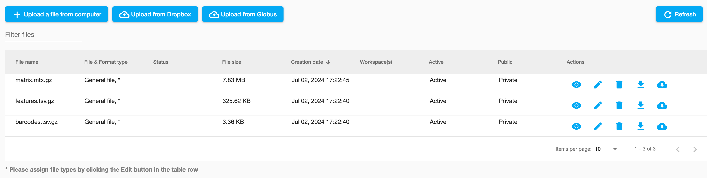
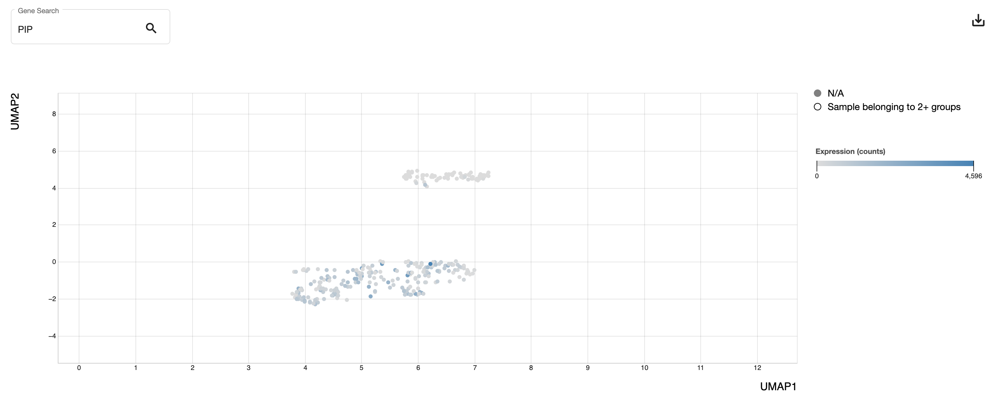

# scRNA-seq Tutorial

This page documents a typical single-cell RNA-seq workflow using publicly available data from 10X Genomics. This is not meant to showcase a comprehensive analysis, but is rather a guide to highlight the various capabilities of a self-guided exploration of this data.

#### Data source

The data source chosen for this analysis was downloaded from the 10x Genomics website. Note that while freely available, the 10X site does require an email to access their example datasets. We choose to use the 10x example data since it's likely that single-cell RNA-seq experiment files will be delivered in a "sparse" format which requires conversion to work with the WebMeV tools. We highlight this step in the tutorial below. Note that screenshots below might differ from those on the 10x Genomics website due to site changes in the future.

After registration, you can navigate to the datasets page using the Resources menu at the top of the page.


At the datasets page, you can choose "Single cell gene expression" under the "Products" filter:


Further filters allow you to define species, disease status, or other factors of interest. For this tutorial we choose the following: https://www.10xgenomics.com/datasets/750-sorted-cells-from-human-invasive-ductal-carcinoma-3-lt-v-3-1-3-1-low-6-0-0 which is described as "750 sorted invasive Ductal Carcinoma cells from a female donor aged 65". 

In the file listing towards the bottom, we choose the "Feature/cell matrix (filtered)" link (https://cf.10xgenomics.com/samples/cell-exp/6.0.0/Breast_Cancer_3p_LT/Breast_Cancer_3p_LT_filtered_feature_bc_matrix.tar.gz). Download this to your machine.

#### Unpack the data

The data is distributed in a compressed format as indicated by the "tar.gz" file extension. To open, you can choose to open with the archive utility (e.g. on Mac) or use the terminal to run 

```shell
tar -zxf Breast_Cancer_3p_LT_filtered_feature_bc_matrix.tar.gz
```

After uncompressing, you should have a folder named "filtered_feature_bc_matrix" which contains three files:

- `matrix.mtx.gz`
- `barcodes.tsv.gz`
- `features.tsv.gz`

These three (gzip-compressed) files collectively contain the single-cell sequencing read abundance data in a typical space-saving format. The `matrix.mtx.gz` file has the abundances in a "matrix market" format, while the `barcodes.tsv.gz` and `features.tsv.gz` provide information about the cell barcodes and genes, respectively. **Note that you should leave these files as-is; do NOT uncompress!**

#### Upload your data to WebMeV

Assuming you have registered an account and logged into the application, the next step is to upload your data. Navigate to the "Files" tab if you are not there already. If this is your first time using WebMeV, the browser will be empty:


Click the "upload a file from computer" button and upload the three files described above:


After upload, the files will appear in the file browser and you will be prompted to tell us their type and format. 


WebMeV uses file type and format to ensure that uploaded files have the proper formatting before they are used in analyses. This is typically where users will tell us that their uploaded file corresponds to an "RNA-seq count matrix" and is in "CSV" format, for instance. 

However, we cannot aim to validate the universe of potential files in computational biology/bioinformatics. Hence, in our case with this single-cell RNA-seq data, we set the three files above to the "General file" type with the wildcard "*" format. We will defer this validation to WebMeV's import tools, to be covered shortly.

Upon clicking the "Set Type/Format" button, you will select the general file type as shown below:


After you have set the type/format for the three files, the file browser should appear as below



#### Create a workspace and add the initial files

To separate distinct analysis projects, WebMeV provides the concept of a "workspace". This allows you to logically separate analysis tasks corresponding to different projects. For example, you can choose to create a workspace corresponding to data obtained from an *in vitro* cell line study and another for a study performed on public, patient-derived TCGA data.

Navigate to the "workspaces" tab and create a new workspace for this single-cell study:


After creating the workspace, click on the link to navigate to your new workspace. You will be brought to a "workspace isolated" file browser. 


As stated at the top of that page, you need to add files to your workspace to work with them. Click "add local data" and select the three uploaded files:


After this, your workspace file browser should look like:


#### Run your first analysis tool - data import

Now that we have the three files in our workspace, we need to prepare the data for use with our analysis tools. As it currently stands, we cannot directly use these files. Recall that the files distributed by 10X Genomics are used to save disk space and reduce transfer/download times. Thus, to make use of these files, we need to perform a data import operation which will create a single count/abundance matrix which we can then use for clustering, differential expression, etc. This count matrix is essentially a large grid/spreadsheet of numbers where each row corresponds to a gene and each column corresponds to a sample barcode. In the context of single-cell RNA-seq, each column (ideally) corresponds to a single, isolated cell.

To perform this import, navigate to the "Tools" tab at the top of the workspace page. On the left menu, you will see a suite of tools generally categorized by their application or domain. Open the "Single-cell (SCTK)" menu and select the "SCTK 10x CellRanger Import":


This will load the tool inputs page in the main panel where you can select the input options. By hovering over the "info" fields, you can view additional information/help about each input. In our case, the correspondance of our three files to the inputs is obvious. For the operation name and sample name, you can make your own choice. Click "Run":


After the import tool completes, you will be directed to a results page. For this particular tool, the input page simply states that there is now a new count matrix in your workspace. In your file browser, you can see that the listing of files is updated, now including 4 files:


If you were to preview this new file using the "eye" icon, you would see a grid of genes and barcodes as described previously. Note that WebMeV has already validated the file to be of type "RNA-seq count matrix" which simply means it contains integer entries.


#### Onto the real analysis...

Now that we have our count matrix, we are ready to perform some typical single-cell analyses. 

As a first step, we choose to run a "doublet-finding" operation which is a basic quality-control step. Without going into too much detail, we note that in an ideal single-cell RNA-seq analysis, each cell is labeled with a "barcode" such that sequenced fragments can be uniquely associated with a single cell. In practice, however, it is possible that multiple cells can be encapsulated together and assigned the same barcode, resulting in ambiguity. By examining the distribution of sequencing reads, doublet-finding tools can estimate the probability of these problematic barcodes and remove them prior to downstream analysis.

Under the SCTK single cell tools, we will use the "SCTK Doublet Finder" tool. The only input required is the count matrix we just created, which should be the only file presented in the dropdown menu. After completion, we are shown a donut plot indicating the percentages of singlets and doublets in the experiment. 


If you were to visit the file browser, you will see that we have two additional files present:


One of these files identifies the singlets and doublets. Since this file annotates the barcodes/cells, it is assigned the "Annotation table" type. If you preview this file, you can see the structure:


The other file is a new, updated count matrix which only includes the barcodes/cells which were assigned as singletons; likely doublets have been removed. 

While not strictly necessary here, we note that if you click on the donut plot, you can select those barcodes/cells which were marked as doublets and assign them to an "observation set". While we have already created a filtered matrix, defining an observation set allows you to manually subset the original count matrix using our "matrix filtering" tool; one could create a count matrix including only singletons (which we have) *or* create a matrix retaining only those doublets (perhaps useful for more detailed QC investigations). Typically, observation sets are used to define experimental groups or other factors (e.g. sex, ethnicity) that can be useful in stratification or contrasts.

By clicking on the doublets, the "Save as a sample set" button is activated and we can assign them to an observation set:


If you go to the metadata tab, you can see that this observation set is reflected:


#### Mapping to gene symbols

If you looked at the preview of the count matrix, you might have noticed that the data was using Ensembl ENSG gene identifiers. Most biologists prefer to work with the "common" gene symbols as they are more familiar and memorable. Thus, we will map our count matrix to the common gene symbols before proceeding with further analysis. This step is not strictly necessary if you are comfortable using Ensembl IDs. Note that this mapping is imperfect as there is not a 1:1 correspondance between the multitude of gene identifier systems. However, most well-studied genes can be reliably mapped.

Under the "basic operations" menu, we select "gene id mapping"


and fill out the form, specifying that we wish to map from Ensembl to Symbol for the human reference. Note that we use the doublet-filtered file (the count matrix with the doublets removed) as the input matrix.


Following this, we have a new matrix where the gene IDs are now symbols.


#### Clustering

Now that we have removed likely doublets and mapped to gene symbols, we can begin to examine the pool of remaining cells and their transcriptional features. One step in a typical single-cell RNA-seq workflow is to perform a clustering operation; this will group transcriptionally similar cells. For this clustering, we will use SCTK's Seurat-based clustering method; Seurat is a popular toolkit used for a multitide of single-cell RNA-seq analyses. For the input to this tool, we leave the defaults and choose the new, filtered count matrix which has the doublets removed. The output page shows 7 clusters and their abundances:


By clicking on the button ("Add these clusters to your workspace metadata"), we can create groups of barcodes/cells corresponding to each group. This will allow us to contrast these clusters and highlight them in plots.


#### Visualizing clusters

The Seurat clustering operation performed in the previous step identified transriptionally similar clusters. Typically, we'd like to visualize this. A common visualization tool for single-cell RNA-seq data involves transforming the high-dimensional count data into a two-dimensional plot through either the tSNE or UMAP method. This is often called an "embedding". Due to the shorter run-time and generally better preservation of global structure, we use the UMAP method. Choose the "SCTK UMAP dimensional reduction" tool and input the same doublet-removed count matrix. The output of this analysis is a 2-dimensional plot where each point represents a barcode/cell. Note that the plot allows us to highlight observation sets. 


If you select the observation sets corresponding to our previously-defined Seurat clusters, we can see how these align with the 2-d embedding. Note that there is typically good correspondance between the groupings of cells in the plot and those clusters determined by Seurat. However, this correspondance is not perfect-- Seurat's clustering uses a different algorithm and the UMAP embedding is simply an attempt to view high-dimensional data.


Also note that if you have a particular gene of interest (e.g. a NK cell marker gene), you can type that into the box to view how this gene is expressed across the cells.

#### Determining cell types

Rather than searching for canonical marker genes one-by-one, we can instead use the singleR tool to call probable cell types. Next, we choose the "SCTK single-cell typing with singleR" tool from the menu and input our data. 

For the input matrix, choose the doublet-removed (and symbol remapped) matrix we've been using for other analyses so far. Since we have human cells, we choose the "Human primary cell atlas" as the reference database. We chose the "fine" annotation level, which attempts fine-grained annotation (e.g. subtypes of macrophages). Also, since we previously mapped from Ensembl to gene symbols, we choose "symbol" for the gene identifier field. However, we could have instead chosen the original Ensembl-based matrix and let the tool perform the mapping to symbols; remapping is required since the databases are often specified in terms of gene symbols. 

The results are presented as a barchart from which we see the vast majority are labeled as epithelial cells. Since the dataset was described as "750 sorted cells", we can safely assume they were selected based on some epithelial cell markers.


As with the Seurat-based clusters, we can export these annotations to observation sets in our workspace. These cell type designations can then be overlaid on the UMAP projection as we had demonstrated above. 

In a non-sorted population, we might expect a little more variety in the types of cells, namely different immune cell populations.

#### Differential expression

Although the vast majority of the cells were labeled as epithelial type, consistent with the sorted pool that was sequenced, we might be interested in defining features of the different clusters. Here, we have several options for our comparison which largely depend on our question of interest. 

For example, we could choose to run differential expression between two Seurat clusters. Or between two annotated cell types, perhaps to investigate why some epithelial cells were labeled as bronchial and others as bladder. Here, we select cells from the plot as shown below by the two circled clusters which collectively encompass several Seurat-based clusters as indicated by the highlighted colors. We use the plot's selection tool to select the cells and export them as new observation sets.


We then use the SCTK MAST single-cell differential expression tool to perform an explicit contrast between these two groups. Note that one could also perform a one-versus-all biomarker style comparison. The ouput of the analysis is a table of genes that are likely to be differentially expressed between our two custom clusters. Among those was the PIP gene (encoding prolactin-induced protein) which is largely unique to the left cluster defined above. We can then return to the UMAP results and view the expression of this gene:


Indeed, while many of the cells in the cluster do not strongly express this gene, the majority of expressing cells are confined to the cluster. Below, we zoom to the clusters we compared for a closer look:



On a different dataset with a variety of immune cells, one can imagine using this to explore the composition of different clusters to determine more detailed information about subtypes.

#### Reproducibility

As with everything in WebMeV, the entire sequence of operations is available for traceable analysis. By visiting the "Analysis flow" tab, you can view a graph of the different analysis operations and how your files were used. Each analysis tool has a corresponding GitHub repository with fully containerized compute environments for reference. In the future, we envision our export to include a fully automated workflow (e.g. using the Nextflow language) to enable further transparency.


